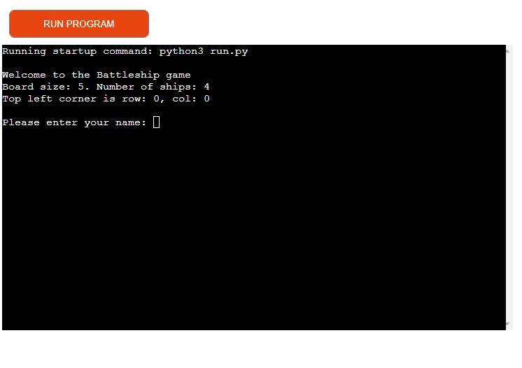
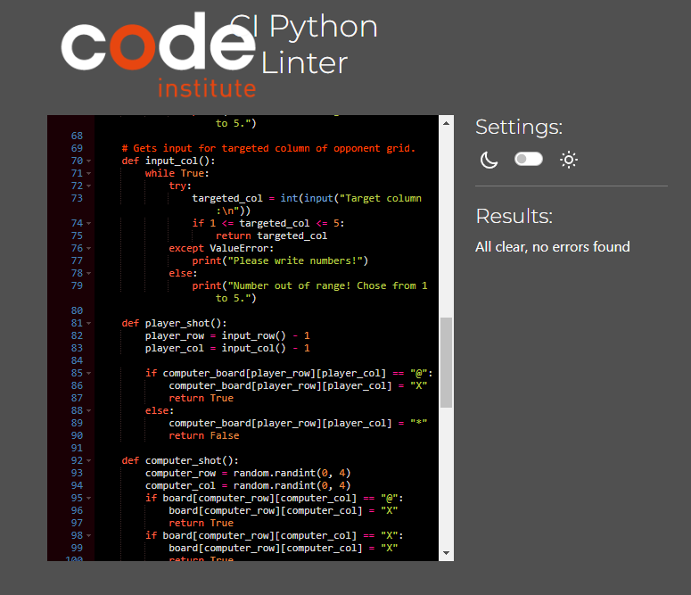

# Battleships game

The Battleships is a Python terminal game that runs on Heroku using Code Institute mock terminal.
The players compete against the computer and try to shoot down computers ships before the computer does that.

## User stories

### Player goals
 - As a player, I want to quickly grasp the rules and objectives of the game.
 - I want a straightforward way to start the game.
 - I want to add my name in the game and be able to identify my board.
 - I want feedback on whether my shots hit the computer's ships or missed. 
 - I want the game to accurately determine and announce the winner when all ships on one side are sunk.
 - I want to be able to view the final state of the game before seeing who won. 

## How to play

- At the beginning, the player is prompted to enter their name.
- After that, he receives his board with randomly placed ships.
- The board of the computer is displayed under the player's board.
- The hits are marked with "X" and misses with "*".
- Each round the player and computer target each other's boards.
- The winner sinks the opponent's battleships first. 

## Features

- Greeting of the player and a short explanation of the game

    

- Customisable player name

    

- Computer as an opponent
- Random ship placement
- Displaying both game boards each turn
- Win conditions
- Clear interface

## Testing 

- PEP8 Validator  https://pep8ci.herokuapp.com/ - All clear, no errors found

    

- The game handles the wrong inputs for rows and columns by accepting only the numbers from 1 to 5.
If the player provides invalid input, they will be prompted to enter valid numeric values between 1 to 5.

    

- If both, the player and the computer win, a tie will be announced. The game stops whenever there are no ships on one or both of the boards.

- Bug when the computer places shots at on the already used points was fixed.

## Bugs

During the development, I encountered a bug in the computer_grid function. The board of the computer had visible ships all the time. 
I solved this bug by duplicating the board and printing only the hits and misses on the copy. 

## Deployment

This project was deployed using Code Institute's mock terminal for Heroku.

To deploy this project on Heroku: 
1. Clone this GitHub repository.
2. Go to Heroku https://dashboard.heroku.com/apps and add a new app.
3. For the buildbacks Chose the "Python" and "NodeJS".
4. Add the GitHub link for the repository.
5. Click on the Deploy button. 

## Credits

- Code Institute for the deployment terminal

