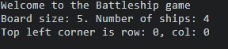
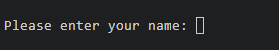
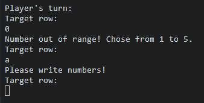

# Battleships game

The Battleships is a Python terminal game that runs on Heroku using Code Institute mock terminal.
The players compete against the computer and try to shot down computers ships before computer does that.

## How to play

At the beginning the playe is prompted to enter their name.
After that he receives his board with randomly placed ships.
The board of the computer is displayed under the players board.
The hits are marked with "X" and misses with "*".
Each round the player and computer target each others boards.
The winner sinks opponent's battleships first. 

## Features

- Greeting of the player and short explanation of the game

    

- Customisable player name

    

- Computer as opponent
    - The computer places it's shots randomly on the board.
- Random ship placement
- Displaying both game boards each turn
- Win conditions
- Error handling
    
- Clear interface

## Validator Testing 

PEP8  https://pep8ci.herokuapp.com/ - All clear, no errors found

## Deployment

This project was deployed using Code Institute's mock terminal for Heroku.

To deploy this project on heroku: 
1. Clone this GitHub repository.
2. Go to Heroku https://dashboard.heroku.com/apps and add a new app.
3. For the buildbacks Chose the "Python" and "NodeJS".
4. Add the Github link for the repository.
5. Click on Deploy button. 

